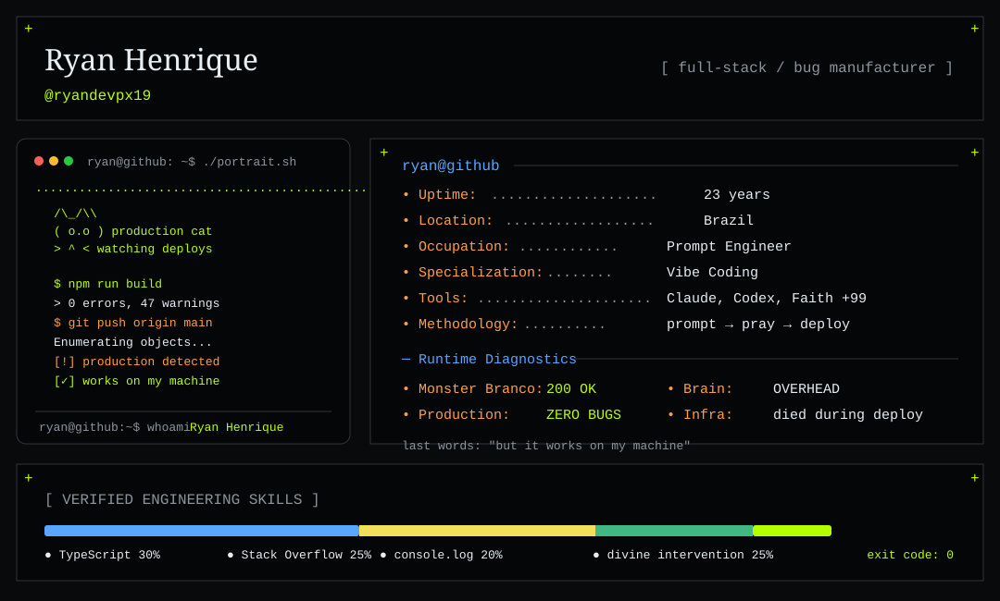

<table align="center" width="100%" border="0" cellspacing="0" cellpadding="0" bgcolor="transparent">
  <tr bgcolor="transparent">
    <td align="center" width="33%" valign="middle" bgcolor="transparent">
      
    </td>
    <td align="center" width="34%" valign="middle" bgcolor="transparent">
      
    </td>
    <td align="center" width="33%" valign="middle" bgcolor="transparent">
      
    </td>
  </tr>
  <tr bgcolor="transparent">
    <td align="center" bgcolor="transparent"><code>developer</code></td>
    <td align="center" bgcolor="transparent"><code>production</code></td>
    <td align="center" bgcolor="transparent"><code>production broke successfully</code></td>
  </tr>
</table>

<p align="center"><code>SYSTEM ARCHITECTURE: no tests • no docs • no fear</code></p>

<picture>
  <source media="(prefers-color-scheme: dark)" srcset="./profile-dark.svg">
  <source media="(prefers-color-scheme: light)" srcset="./profile-light.svg">
  
</picture>

<details>
<summary><b>🚨 production incident protocol</b></summary>

```bash
sudo systemctl restart everything
docker compose down && docker compose up -d
git reset --hard HEAD~1
clear
echo "ninguém viu nada"
```

**Root cause:** unknown  
**Solution:** restart  
**Lessons learned:** none

</details>

<details>
<summary><b>🧠 source code</b></summary>

```js
while (alive) {
  code();

  if (production.isDown()) {
    console.log("estranho, aqui funciona");
  }
}
```

</details>

<p align="center"><b>IT WORKS ON MY MACHINE™</b><br><sub>therefore the machine is now the server.</sub></p>
